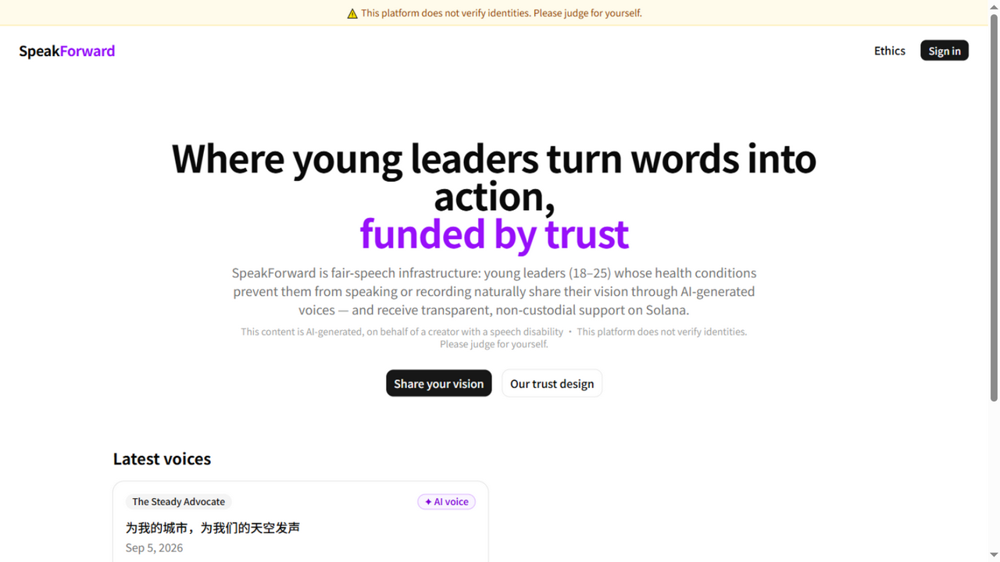
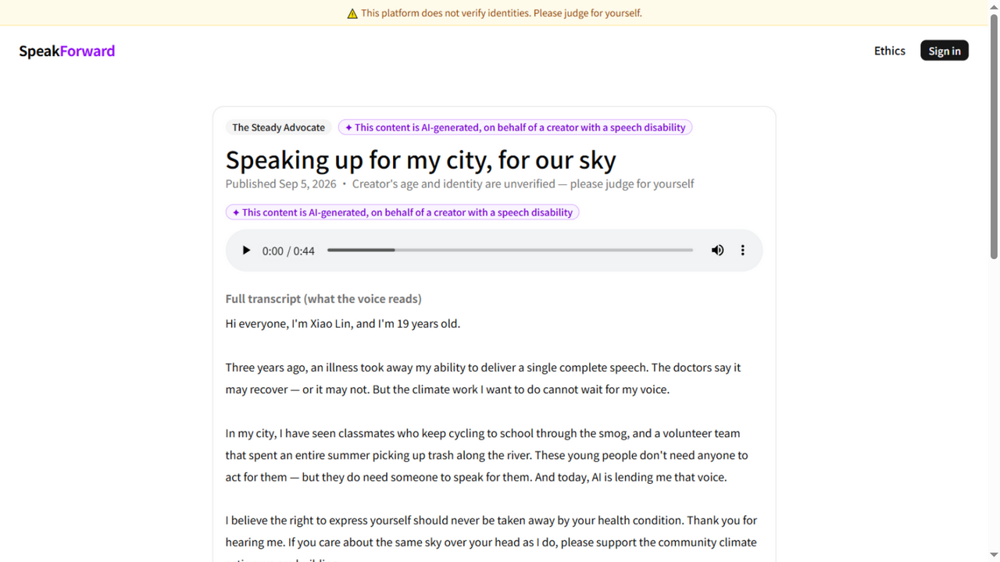

<div align="center">

# 🎙️ SpeakForward

### Where young leaders turn words into action, funded by trust.

**Fair-speech infrastructure for young leaders whose voices need a helping hand.**

[](https://speakforward.vercel.app)
[](https://nextjs.org)
[](https://www.typescriptlang.org)
[](https://supabase.com)
[](https://elevenlabs.io)
[](https://solana.com)
[](LICENSE)

</div>

---

## 🌤️ The Problem

Every community has young leaders with a vision — and some of them **cannot physically deliver a speech**. Vocal cord injuries, severe anxiety, ALS, stroke recovery, chronic fatigue syndrome.

Most platforms respond by asking for medical proof. But proof is a privilege: the people who most need to be heard are often exactly the people who cannot navigate that paperwork.

**SpeakForward takes a different deal.** You declare your situation in a short, public statement. An AI voice — chosen from three designed personas — speaks your words. Supporters judge your sincerity for themselves, and support you directly, wallet to wallet, on Solana.

> ⚠️ *This platform does not verify identities. Please judge for yourself.*

## ✨ What's Inside

| | |
|---|---|
| 🗣️ **AI voices, honestly labeled** | Three designed personas ("Steady Advocate", "Warm Storyteller", "Powerful Mobilizer"). Every request embeds ElevenLabs' AI-disclosure flag, and every page shows it. |
| 📜 **Public health statements** | Written by the creator, shown on the project page. Not a privacy breach — the foundation of community trust. |
| ⚓ **On-chain proof of existence** | Publishing anchors a SHA-256 content hash on Solana Devnet via a Memo instruction. No custom programs. |
| 💸 **Non-custodial donations** | SOL moves from the donor's Phantom straight to the creator's wallet. The platform holds, routes, and custodies… nothing. |
| 🤝 **Pledges for the wallet-less** | A clearly-labeled, localStorage-only promise for people without crypto. |
| 🛡️ **Graceful degradation** | If ElevenLabs goes down, projects still publish and a "temporary voice engine" (Web Speech API) takes over — disclosure intact. |

## 📸 See It

<div align="center">
  
  <p><em>Landing page — mission, disclosure, and the latest voices</em></p>
  
  <p><em>A project page — AI-generated audio, public health statement, Devnet donation ledger</em></p>
</div>

## 🚀 Run It Locally

```bash
git clone https://github.com/aaaadoga/SpeakForward.git
cd SpeakForward
npm install
cp .env.example .env.local    # fill in your keys
npm run dev
```

Then run the SQL in [`supabase/schema.sql`](supabase/schema.sql) once in your Supabase project's SQL Editor.

<details>
<summary><b>Environment variables</b></summary>

| Variable | Purpose | Exposure |
|---|---|---|
| `NEXT_PUBLIC_SUPABASE_URL` | Project URL | public |
| `NEXT_PUBLIC_SUPABASE_ANON_KEY` | Browser client (RLS-protected) | public |
| `SUPABASE_SERVICE_ROLE_KEY` | Server-side admin ops | server only |
| `ELEVENLABS_API_KEY` | Voice generation | server only |

</details>

<details>
<summary><b>Tech stack</b></summary>

| Layer | Choice |
|---|---|
| Full-stack | Next.js 16 (App Router) · TypeScript · Turbopack |
| UI | Tailwind CSS v4 · shadcn/ui (Base UI) |
| Backend | Supabase — Postgres + RLS, magic-link auth, S3-compatible Storage |
| Voice | ElevenLabs `eleven_flash_v2_5`, three designed personas |
| Chain | `@solana/web3.js` + wallet-adapter · client-side Phantom signing · Devnet |
| Hosting | Vercel |

</details>

## 🛡️ Our Trust Design

Every ethical decision in SpeakForward was **finalized before development started** — they are the product, not a compliance layer. The full rationale lives in [`docs/ETHICS.md`](docs/ETHICS.md), including why we refuse KYC, why health statements are public, and why the platform is *structurally incapable* of touching donations.

## 📄 License

[MIT](LICENSE) — built in the open for the [DEV Weekend Challenge: Generosity Edition](https://dev.to/challenges/weekend-2026-09-03).

<div align="center">
  <sub>Powered by ElevenLabs · Solana Devnet · Zero human recordings were harmed in the making of this demo — none were used at all.</sub>
</div>
